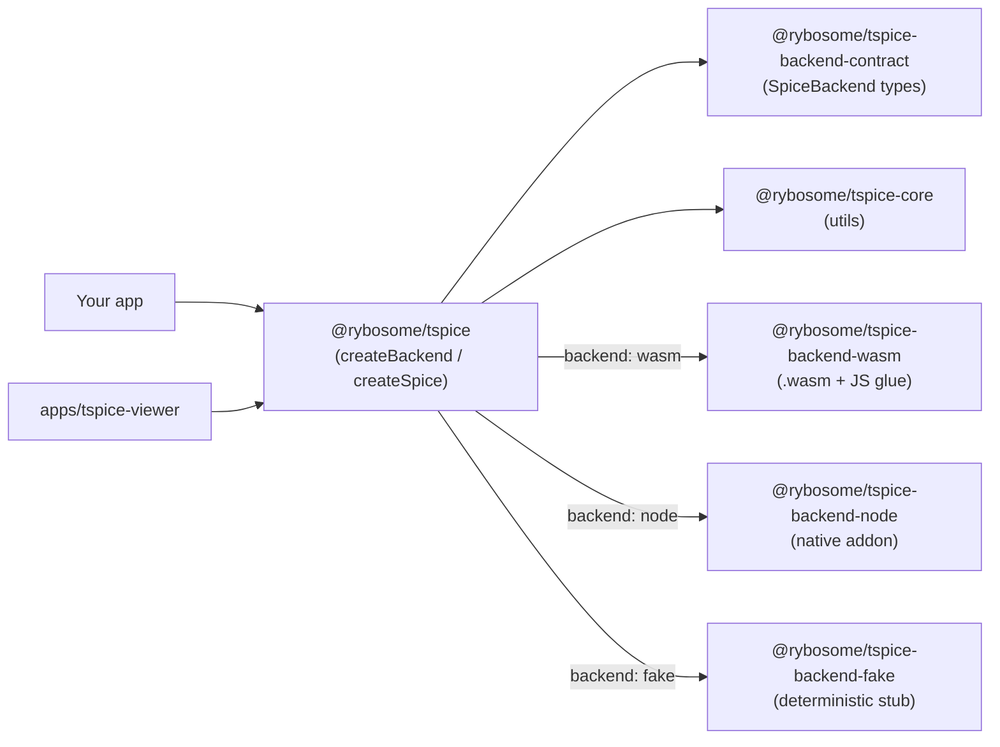

# `tspice`: Idiomatic TypeScript Wrapper for SPICE

## 🎯 Project Goal

**`tspice`**, an idiomatic TypeScript library that:

- Exposes a **typed, ergonomic API** for SPICE operations
- Supports **Node** and **WASM**
- Hides low-level SPICE details behind a stable TypeScript abstraction

This project **does not** attempt to reimplement SPICE in TypeScript. Instead, it provides a clean, powerful API on top of an existing SPICE core.

## Quickstart

> Note: this repo is a pnpm monorepo (workspace). Packages are currently marked
> `private: true`, so you typically use `tspice` from within this workspace.

Install dependencies:

```bash
pnpm install
```

Minimal usage (defaults to the WASM backend):

```ts
import { createSpice } from "@rybosome/tspice";

async function main() {
  const spice = await createSpice();
  console.log(spice.backend.kind); // "wasm" (default)
  console.log(spice.backend.spiceVersion());
}

main().catch(console.error);
```


## Usage

### Backend selection

`createSpice()` and `createBackend()` can run against multiple backend implementations:

- `backend: "wasm"` (default): runs SPICE in WebAssembly.
- `backend: "node"`: runs SPICE via a Node native addon.
- `backend: "fake"`: deterministic stub (useful for tests / apps).

```ts
import { createSpice } from "@rybosome/tspice";

async function main() {
  const wasm = await createSpice();
  const node = await createSpice({ backend: "node" });

  console.log(wasm.backend.kind); // "wasm"
  console.log(node.backend.kind); // "node"
}

main().catch(console.error);
```

### Kernel loading

#### 10,000-foot view

SPICE is *kernel driven*: before you can do anything interesting (time conversion, ephemeris, geometry, frames), you need to load one or more **kernels**.

At a minimum, most apps will load:

- **LSK** (leap seconds): required for `UTC` ↔ `ET` conversion.
- **SPK** (ephemeris): required for most position/velocity queries.

And often also:

- **PCK** (body constants/shape/orientation)
- **FK/CK/SCLK/IK** (frames, attitudes, spacecraft clocks, instrument geometry)

How you load kernels depends heavily on backend and environment:

1) **Node kernel loading** (native addon can load from disk paths)
2) **WASM kernel loading** (browser-realistic: you typically fetch bytes and write to a virtual FS)

#### Node kernel loading

If you're using the Node backend (`createSpice({ backend: "node" })`), you can load kernels directly from filesystem paths.

```ts
import { createSpice } from "@rybosome/tspice";

// Example path. This file does not exist in this repo; use your own kernel layout.
const LSK_ON_DISK = "/path/to/your/kernels/naif0012.tls";

async function main() {
  const spice = await createSpice({ backend: "node" });

  // Node-only: load kernels directly from disk paths.
  spice.loadKernel(LSK_ON_DISK);
}

main().catch(console.error);
```

If you want the *same* kernel-loading call site to work in both Node and WASM, you can provide bytes instead:

```ts
import fs from "node:fs";

import { createSpice } from "@rybosome/tspice";

// Example path. This file does not exist in this repo; use your own kernel layout.
const LSK_ON_DISK = "/path/to/your/kernels/naif0012.tls";

async function main() {
  const spice = await createSpice({ backend: "node" });

  spice.loadKernel({
    // A stable identifier you can also use with `unloadKernel()`.
    // For WASM this is also the path inside the in-memory filesystem.
    path: "/kernels/naif0012.tls",
    bytes: fs.readFileSync(LSK_ON_DISK),
  });
}

main().catch(console.error);
```

#### WASM kernel loading (browser-realistic)

In a browser you typically can’t read from arbitrary disk paths. Instead, you host kernels as static assets and **fetch their bytes**.

```ts
import { createSpice } from "@rybosome/tspice";

async function fetchKernelBytes(url: string): Promise<Uint8Array> {
  const res = await fetch(url);
  if (!res.ok) {
    throw new Error(`Failed to fetch kernel ${url}: ${res.status} ${res.statusText}`);
  }
  return new Uint8Array(await res.arrayBuffer());
}

async function main() {
  const spice = await createSpice({ backend: "wasm" });

  spice.loadKernel({
    path: "/kernels/naif0012.tls",
    bytes: await fetchKernelBytes("/kernels/naif0012.tls"),
  });
}

main().catch(console.error);
```

### Advanced: ephemeris state (`utcToEt` + `getState`)

```ts
import { createSpice } from "@rybosome/tspice";

async function main() {
  const spice = await createSpice();

  // Requires you to have already loaded an LSK + SPK kernels.
  const et = spice.utcToEt("2025-01-01T00:00:00Z");

  const state = spice.getState({
    target: "MARS",
    observer: "EARTH",
    at: et,
    frame: "J2000",
    aberration: "LT+S",
  });

  console.log(state.position, state.velocity, state.lightTime);
}

main().catch(console.error);
```

### Advanced: geometry (`subslr` + `reclat` + `ilumin`)

This example computes the sub-solar point on a target body and then reports illumination angles at that point.

Note: `createSpice()` currently exposes a *mid-level* API (`utcToEt`, `getState`, etc). Lower-level SPICE calls that aren't wrapped yet (like `subslr`) are available on `spice.backend`.

```ts
import { createSpice } from "@rybosome/tspice";

const radToDeg = (radians: number) => (radians * 180) / Math.PI;

async function main() {
  const spice = await createSpice();

  // Requires appropriate kernels (LSK + PCK + SPK, at minimum).
  const et = spice.utcToEt("2025-01-01T00:00:00Z");

  const { spoint } = spice.backend.subslr(
    "Near Point: Ellipsoid",
    "MARS",
    et,
    "IAU_MARS",
    "LT+S",
    "SUN",
  );

  const { lon, lat } = spice.backend.reclat(spoint);

  const { phase, incdnc, emissn } = spice.backend.ilumin(
    "Ellipsoid",
    "MARS",
    et,
    "IAU_MARS",
    "LT+S",
    "SUN",
    spoint,
  );

  console.log({
    subSolarLonDeg: radToDeg(lon),
    subSolarLatDeg: radToDeg(lat),
    phaseDeg: radToDeg(phase),
    solarIncidenceDeg: radToDeg(incdnc),
    emissionDeg: radToDeg(emissn),
  });
}

main().catch(console.error);
```

## Monorepo / package map

| Path | Package | Purpose |
| --- | --- | --- |
| `packages/tspice` | `@rybosome/tspice` | Public facade: `createBackend()`, `createSpice()`, exported types |
| `packages/backend-wasm` | `@rybosome/tspice-backend-wasm` | WASM backend implementation (**default**) |
| `packages/backend-node` | `@rybosome/tspice-backend-node` | Node.js native-addon backend implementation (opt-in) |
| `packages/backend-fake` | `@rybosome/tspice-backend-fake` | Deterministic stub backend (tests / apps) |
| `packages/backend-contract` | `@rybosome/tspice-backend-contract` | Shared backend interface + types |
| `packages/core` | `@rybosome/tspice-core` | Shared utilities and small helpers |
| `packages/backend-shim-c` | `@rybosome/tspice-backend-shim-c` | WIP / internal shim code |
| `apps/tspice-viewer` | `@rybosome/tspice-viewer` | Example app + Playwright e2e tests |

## Verification

From the repo root:

```bash
# JS-only checks: compliance, build, typecheck, tests (skips native addon)
pnpm check

# Playwright e2e for the viewer app
pnpm -C apps/tspice-viewer e2e

# Full native build + checks (requires a working node-gyp toolchain)
pnpm check:native
```

Native prerequisites (contributors): Python 3 + `node-gyp` toolchain (compiler,
`make`, etc). The native build will fetch CSPICE into the repo-local `.cache/`.

## CSPICE disclosure & policy

`tspice` is designed to embed CSPICE-derived components only as an internal implementation detail to support its TypeScript API, and not as a general-purpose distribution of CSPICE. This section is an overview; see the policy doc for the canonical constraints.

- See [`docs/cspice-naif-disclosure.md`](./docs/cspice-naif-disclosure.md) for the canonical disclosure text, NAIF links, and pointers to notice files.
- See [`docs/cspice-policy.md`](./docs/cspice-policy.md) for the project's CSPICE usage and distribution policy, including redistribution constraints and third-party interface guidance that contributors and maintainers are expected to follow.

Compliance notes:

- Do **not** commit `.cache/` (it contains fetched CSPICE toolkits and build
  artifacts). The repo ignores `.cache/`, but please keep it local.
- `pnpm check` runs `pnpm run check:compliance`, which executes
  `scripts/check-compliance-files.mjs` as a guardrail to ensure disclosure,
  policy, notices, and linked compliance files stay present and readable.

## Examples

- Unit tests live under `packages/*/test`.
- `apps/tspice-viewer` is a real example consumer (plus an e2e harness).
- `apps/tspice-viewer/src/spice/FakeSpiceClient.ts` is a deterministic stub
  implementation that’s useful for app/dev flows when you don’t want to depend
  on real kernels.

---

## 🧱 High-Level Architecture

At a high level, this repo is a monorepo with a thin public facade, a shared backend contract, and multiple backend implementations.



### Packages (what lives where)

- `packages/tspice` (`@rybosome/tspice`): public entrypoint.
  - `createBackend()` selects and instantiates a backend.
  - `createSpice()` wraps the backend with a small, typed convenience surface (`loadKernel`, `utcToEt`, `getState`, ...).
- `packages/backend-contract` (`@rybosome/tspice-backend-contract`): the shared interface (`SpiceBackend`) that all backends implement.
- `packages/backend-wasm` (`@rybosome/tspice-backend-wasm`): WASM backend.
  - Loads kernels into an in-memory filesystem.
- `packages/backend-node` (`@rybosome/tspice-backend-node`): Node backend.
  - Loads kernels either directly from disk paths, or by staging byte-backed kernels to temp files.
- `packages/backend-fake` (`@rybosome/tspice-backend-fake`): fake backend used by example apps/tests.
- `packages/core` (`@rybosome/tspice-core`): small utilities shared across packages.
- `apps/tspice-viewer`: example consumer + Playwright e2e.

### Reality check: `spice.backend` vs `spice.*`

Today, only a subset of SPICE calls are wrapped directly on the `Spice` type returned by `createSpice()`.

- If you want a stable, ergonomic surface: use `spice.loadKernel()`, `spice.utcToEt()`, `spice.getState()`, etc.
- If you need a lower-level SPICE call that isn't wrapped yet: use `spice.backend.<fn>()`.
