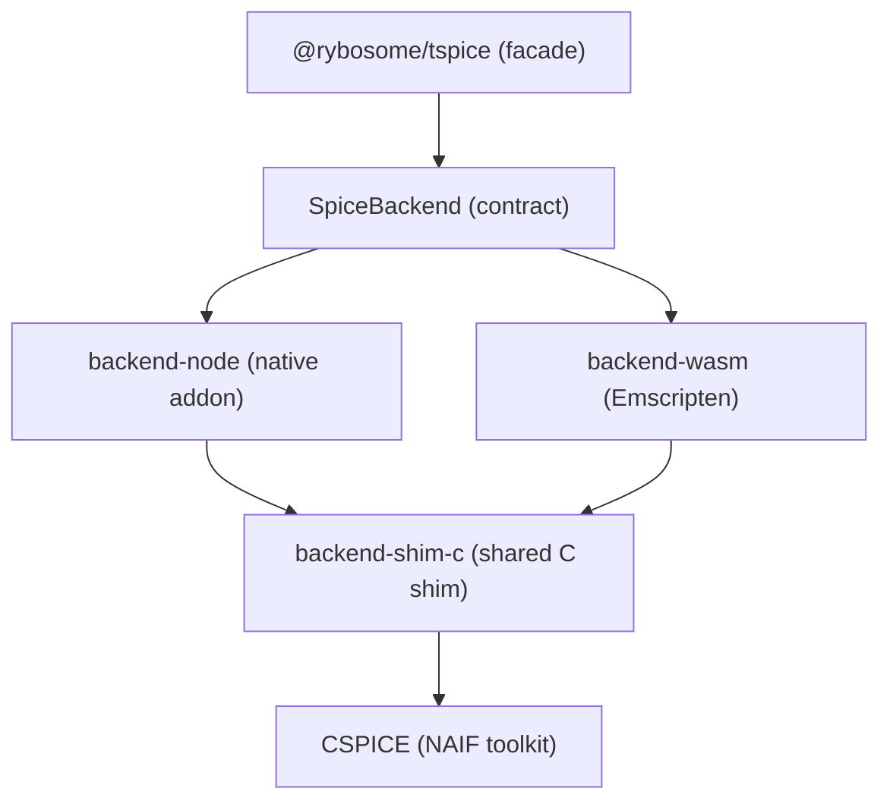

# tspice

TypeScript-first access to NAIF SPICE geometry — in **Node.js** and the **browser** (via WebAssembly).

- **Docs:** https://rybosome.github.io/tspice
- **Live demo (WebGL + WASM):** https://orrery.ryboso.me/

`tspice` is a set of TypeScript packages that let you load SPICE kernels and run common SPICE workflows (time conversions, ephemerides, frames, geometry) from modern JS runtimes.

tspice embeds CSPICE-derived components behind a TypeScript API; if you need CSPICE itself as a general-purpose toolkit, download it [directly from NAIF](https://naif.jpl.nasa.gov/naif/toolkit_C.html)

## Why tspice

- **CSPICE** is the official, battle-tested toolkit from NAIF. It’s the right choice if you’re happy living in C/C++/Fortran or writing/maintaining your own bindings.
- **SpiceyPy** is an excellent Python wrapper around CSPICE. It’s great for Python-first analysis workflows.
- **ANISE** is a Rust project focused on performance and a modern API for SPICE workflows.
- **tspice** targets a different niche: **TypeScript-first**, **browser-capable**, and designed for app-style workloads (interactive visualization, UI tooling, Web Workers).

If your target runtime is a browser, or your application is already TypeScript/Node and you want a first-class TS API, `tspice` is aimed at that gap.

## Quickstart (WASM in the browser)

> The published `@rybosome/tspice` package is **ESM-only**.

```bash
pnpm add @rybosome/tspice
# or: npm i @rybosome/tspice
```

```ts
import { kernels, spiceClients } from "@rybosome/tspice";

// A small, CORS-enabled catalog hosted for quickstart/testing.
// Not recommended for production (see notes below).
const kernelPack = kernels.tspice().pick(
  "lsk/naif0012.tls",
  "pck/pck00011.tpc",
  "spk/planets/de432s.bsp",
);

const { spice, dispose } = await spiceClients
  .withKernels(kernelPack) // fetches + stages bytes before loading
  .toAsync({ backend: "wasm" });

try {
  const et = await spice.kit.utcToEt("2000 JAN 01 12:00:00");
  const state = await spice.kit.getState({ target: "EARTH", observer: "SUN", at: et });
  console.log(state.position, state.velocity);
} finally {
  await dispose();
}
```

**Kernel hosting note:** browsers can’t fetch kernels directly from NAIF due to CORS. `kernels.tspice()` points at a small community mirror for quickstart/testing and is **not recommended for production**. For production, self-host kernels (or proxy) and use `kernels.naif(...)` / `kernels.custom(...)`.

## Design principles

- **TypeScript-first API:** typed inputs/outputs for common workflows via `spice.kit`, with escape hatches via `spice.raw`.
- **Backend-agnostic surface area:** one client API, multiple backend implementations.
- **Explicit kernels:** SPICE is kernel-driven and stateful; kernel load order matters and `tspice` keeps that reality visible.
- **Browser-realistic execution:** WebAssembly + Web Worker support for UI-friendly workloads.

## Validation

In addition to typical unit testing, `tspice` runs **parity tests** with **CSPICE as the reference**, and also checks that the Node and WASM backends stay consistent for the same kernels and inputs.

- **CSPICE reference parity:** the YAML-driven verification harness (`packages/backend-verify`) executes the same scenarios against raw CSPICE and `tspice` (Node/WASM), comparing results with numeric tolerances instead of baked-in “golden” answers.
- **Method-level contract coverage:** the backend contract is documented method-by-method against CSPICE in [`docs/parity/spicebackend-cspice-mapping.md`](docs/parity/spicebackend-cspice-mapping.md).
- **Unit + cross-backend tests:** per-package tests cover API behavior, error handling, and a growing set of direct Node ↔ WASM parity cases.

## Architecture

1. **`@rybosome/tspice` (facade)** — the user-facing entrypoint (`packages/tspice/`).
2. **`SpiceBackend` (contract)** — the shared TypeScript interface all backends implement (`packages/backend-contract/`).
3. **Backend implementations** — concrete runtimes that satisfy the contract:
   - Node native addon: `packages/backend-node/`
   - WASM (Emscripten): `packages/backend-wasm/`
4. **`backend-shim-c` (shared C shim)** — a shared C integration layer reused by both backends (`packages/backend-shim-c/`).
5. **CSPICE** — the NAIF toolkit, linked into the native addon or compiled into the `.wasm`.


```mermaid
flowchart TD
  Facade["@rybosome/tspice (facade)"] --> Contract["SpiceBackend (contract)"]
  Contract --> Node["backend-node (native addon)"]
  Contract --> Wasm["backend-wasm (Emscripten)"]
  Node --> Shim["backend-shim-c (shared C shim)"]
  Wasm --> Shim
  Shim --> CSPICE["CSPICE (NAIF toolkit)"]
```

## Backend comparison (Node native vs WASM)

| | Node native (`backend: "node"`) | WASM (`backend: "wasm"`) |
| --- | --- | --- |
| Runs in | Node.js only | Browsers + Node.js |
| Artifact | Native addon (`.node`) | Prebuilt WebAssembly (`.wasm`) + JS glue |
| Best for | Node services, local kernel archives, potential performance wins | Browsers, Web Workers, portability |
| Kernel I/O shape | OS filesystem paths (plus optional byte staging) | Byte-backed loads into a virtual filesystem |
| Operational constraints | **none** | Needs the `.wasm` asset to be served/bundled correctly (may require an explicit `wasmUrl`) |

## Roadmap (high-level)

- Expand parity test coverage (Node ↔ WASM) with more fixtures and scenarios.
- Expand CSPICE implementation coverage (link to https://github.com/rybosome/tspice/blob/main/docs/cspice-function-inventory.md)
- Performance measurement and improvement
- Additional `kit` functions and client functionality - e.g. batching
