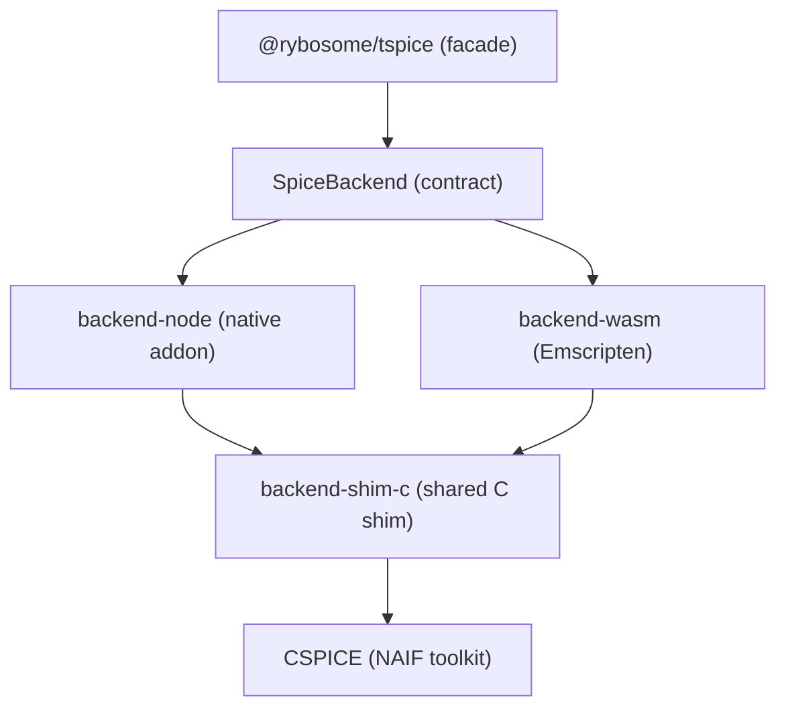

# tspice

[](https://github.com/rybosome/tspice/actions/workflows/ci.yml) [](LICENSE)

TypeScript-first access to NASA’s SPICE geometry toolkit — in **Node.js** and the **browser** (via WebAssembly).

- **Docs:** https://rybosome.github.io/tspice
- **Live demo (WebGL + WASM):** https://orrery.ryboso.me/


SPICE is a toolkit (and data format ecosystem) developed by **NAIF (NASA’s Navigation and Ancillary Information Facility)** for space-mission geometry. It computes positions, orientations, frames, and time conversions using mission-provided “kernels” (ephemerides, constants, pointing, etc.). It’s widely used across NASA and the planetary science community to make geometry calculations reproducible and shareable.

`tspice` is a set of TypeScript packages that let you load SPICE kernels and execute common SPICE workflows (time conversion, ephemerides, frames, geometry) from modern JS runtimes.

## Why tspice

- **CSPICE** is the official NAIF toolkit, battle-tested and widely used in mission operations and research. It’s the reference implementation and the right choice if you’re working directly in C/C++/Fortran or maintaining your own bindings.
- **SpiceyPy** is a mature, well-maintained Python wrapper around CSPICE. It’s widely adopted in the planetary science community and excellent for Python-first analysis workflows.
- **ANISE** is a modern Rust-based reimplementation of key SPICE capabilities, focused on performance, concurrency, and a strongly typed API. It offers an alternative design philosophy and is well suited for high-performance or cloud-scale workloads.
- **tspice** targets a different niche: **TypeScript-first**, **browser-capable**, and designed for app-style workloads (interactive visualization, UI tooling, Web Workers).

If your target runtime is a browser, or your application is already TypeScript/Node and you want a first-class, typed API over CSPICE, `tspice` is designed to fill that gap.

`tspice` links against CSPICE (or a CSPICE-derived build) behind a TypeScript API. If you need CSPICE directly, download it from [NAIF](https://naif.jpl.nasa.gov/naif/toolkit_C.html).

## Installation & requirements

- **Node.js:** 20+ (tested on **Node 20** and **Node 22**).
- **Module format:** `@rybosome/tspice` is **ESM-only**.
- **Browsers (WASM backend):** a modern browser with WebAssembly, plus a bundler/dev server that can serve `.wasm` assets (you may need to provide an explicit `wasmUrl` depending on your tooling).
- **Kernel hosting / CORS:** browsers can only fetch kernels from a CORS-enabled origin; NAIF’s kernel servers typically don’t set CORS headers, so for production you’ll need to self-host kernels (or proxy them).

## Mental model

SPICE is stateful: loading kernels mutates a process-wide global kernel pool inside SPICE, and many routines read from (and sometimes affect) that shared state.

Isolation (separating kernel-sets and workloads) can be achieved by creating multiple process or WebWorker instances, depending on runtime.

## Quickstart 

### Installation

```bash
pnpm add @rybosome/tspice
# or: npm i @rybosome/tspice
```

### Browser (WASM backend)

```ts
import { kernels, spiceClients } from "@rybosome/tspice";

async function main() {
  // A small, CORS-enabled catalog hosted for quickstart/testing.
  // Not suitable for production.
  const kernelPack = kernels.tspice().pick(
    "lsk/naif0012.tls",
    "pck/pck00011.tpc",
    "spk/planets/de432s.bsp",
  );

  // Build the client and load the given kernels
  const { spice, dispose } = await spiceClients
    .withKernels(kernelPack)
    .toAsync({ backend: "wasm" });

  try {
    const et = await spice.kit.utcToEt("2000 JAN 01 12:00:00");
    const state = await spice.kit.getState({ target: "EARTH", observer: "SUN", at: et });
    console.log(state.position, state.velocity);
  } finally {
    await dispose();
  }
}

main().catch(console.error);
```

In a production application, it is recommended to host kernels yourself or enable a proxy.

The `kernels.naif()` catalog can be configured to point at your hosted entries, or you can load bespoke kernels.

```ts
import { kernels } from "@rybosome/tspice";

// Hosting a mirror of NAIF's catalog at https://your-app.example/kernels/naif
const naifKernels = kernels
  .naif({
    origin: "https://your-app.example/kernels/naif/",
    pathBase: "naif/",
  })
  .pick(
    "lsk/naif0012.tls",
    "pck/pck00011.tpc",
    "spk/planets/de432s.bsp",
  );

// Hosting a custom catalog at https://your-app.example/kernels/custom
const customKernels = kernels
  .custom({
    origin: "https://your-app.example/kernels/custom/",
    pathBase: "custom/",
  })
  .pick("planets/my_custom_kernel.bsp");
```

### Node

```ts
import { kernels, spiceClients } from "@rybosome/tspice";

async function main() {
  // We can download kernels directly from NAIF servers in Node.
  const kernelPack = kernels.naif()
    .pick(
      "lsk/naif0012.tls",
      "pck/pck00011.tpc",
      "spk/planets/de432s.bsp",
    );

  // Use the builder to create a synchronous, caching client.
  // `dispose()` is still async and should be awaited.
  const { spice, dispose } = await spiceClients
    .caching({ maxEntries: 10_000, ttlMs: null })
    .withKernels(kernelPack)
    .toSync({ backend: "node" });

  try {
    const et = spice.kit.utcToEt("2000 JAN 01 12:00:00");
    const state = spice.kit.getState({ target: "EARTH", observer: "SUN", at: et });
    console.log(state.position, state.velocity);
  } finally {
    await dispose();
  }
}

main().catch(console.error);
```

## Coverage

CSPICE exposes 652 public routines; 154 are currently implemented in `tspice`.

- **Detailed function inventory:** [`docs/cspice-function-inventory.md`](docs/cspice-function-inventory.md)

## API Stability

`tspice` exposes a stable backend contract that models the CSPICE routine surface. That contract is designed to evolve conservatively as additional CSPICE functions are implemented.

`tspice` follows SemVer. As a pre-1.0.0 project, **minor versions may introduce breaking changes**. Within a given minor line (e.g. `0.1.x`), patch releases are guaranteed not to break the public API.

Because CSPICE itself is a mature and stable toolkit, long-term API churn in `tspice` is expected to be low.


## Validation

In addition to typical unit testing, `tspice` runs **parity tests** with **CSPICE as the reference**, and also checks that the Node and WASM backends stay consistent for the same kernels and inputs. `tspice` preserves CSPICE double-precision semantics; numeric comparisons are verified against CSPICE with defined tolerances.

- **CSPICE reference parity:** the YAML-driven verification harness (`packages/backend-verify`) executes the same scenarios against raw CSPICE and `tspice` (Node/WASM), comparing results with numeric tolerances instead of baked-in “golden” answers.
- **Method-level contract coverage:** the backend contract is documented method-by-method against CSPICE in [`docs/parity/spicebackend-cspice-mapping.md`](docs/parity/spicebackend-cspice-mapping.md).
- **Unit + cross-backend tests:** per-package tests cover API behavior, error handling, and a growing set of direct Node ↔ WASM parity cases.

## Architecture

1. **`@rybosome/tspice` (facade)** — the user-facing entrypoint (`packages/tspice/`).
2. **`SpiceBackend` (contract)** — the shared TypeScript interface all backends implement (`packages/backend-contract/`).
3. **Backend implementations** — concrete runtimes that satisfy the contract:
   - Node native addon: `packages/backend-node/`
   - WASM (Emscripten): `packages/backend-wasm/`
4. **`backend-shim-c` (shared C shim)** — a shared C integration layer reused by both backends (`packages/backend-shim-c/`).
5. **CSPICE** — the NAIF toolkit, linked into the native addon or compiled into the `.wasm`.


```mermaid
flowchart TD
  Facade["@rybosome/tspice (facade)"] --> Contract["SpiceBackend (contract)"]
  Contract --> Node["backend-node (native addon)"]
  Contract --> Wasm["backend-wasm (Emscripten)"]
  Node --> Shim["backend-shim-c (shared C shim)"]
  Wasm --> Shim
  Shim --> CSPICE["CSPICE (NAIF toolkit)"]
```

## Backend comparison (Node native vs WASM)

| | Node native (`backend: "node"`) | WASM (`backend: "wasm"`) |
| --- | --- | --- |
| Runs in | Node.js only | Browsers + Node.js |
| Artifact | Native addon (`.node`) | Prebuilt WebAssembly (`.wasm`) + JS glue |
| Best for | Node services, local kernel archives, potential performance wins | Browsers, Web Workers, portability |
| Kernel I/O shape | OS filesystem paths (plus optional byte staging) | Byte-backed loads into a virtual filesystem |
| Operational constraints | **none** | Needs the `.wasm` asset to be served/bundled correctly (often via bundler asset handling or explicit `wasmUrl`) |

## Roadmap (high-level)

- Expand parity test coverage (Node ↔ WASM) with more fixtures and scenarios.
- Expand CSPICE implementation coverage (see [`docs/cspice-function-inventory.md`](docs/cspice-function-inventory.md))
- Performance measurement and improvement
- Additional `kit` functions and client functionality - e.g. batching

## Contributing

See [`CONTRIBUTING.md`](CONTRIBUTING.md).

## License

MIT — see [`LICENSE`](LICENSE).
