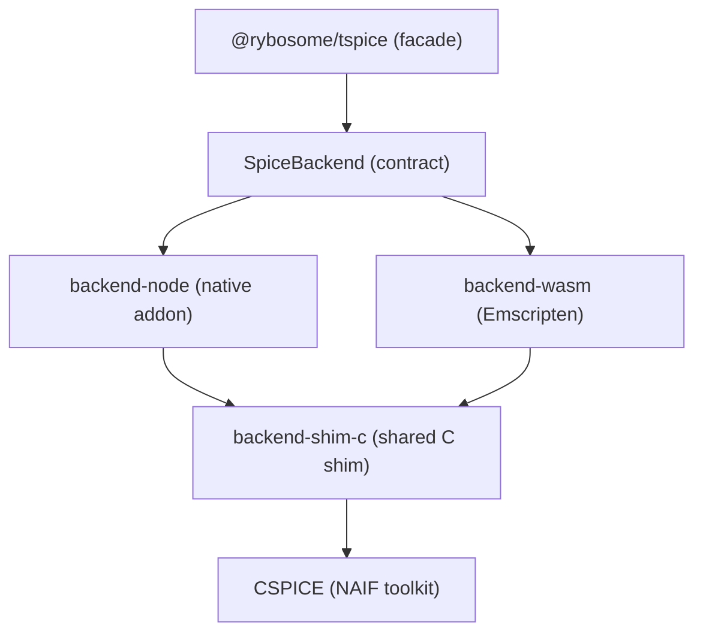

# Architecture

This section is for contributors: how `tspice` is layered, where the seams are, and why the backends behave the way they do.

## The stack (top to bottom)

1. **`@rybosome/tspice` (facade)** — the user-facing entrypoint (`packages/tspice/`).
2. **`SpiceBackend` (contract)** — the shared TypeScript interface all backends implement (`packages/backend-contract/`).
3. **Backend implementations** — concrete runtimes that satisfy the contract:
   - Node native addon: `packages/backend-node/`
   - WASM (Emscripten): `packages/backend-wasm/`
4. **`backend-shim-c` (shared C shim)** — a shared C integration layer reused by both backends (`packages/backend-shim-c/`).
5. **CSPICE** — the NAIF toolkit, linked into the native addon or compiled into the `.wasm`.

## One CSPICE state space (and why we serialize)

CSPICE keeps a lot of state in C globals (loaded kernels, the kernel pool, error status, and many internal registries). How *global* that state is depends on the backend runtime:

- **Node backend:** CSPICE is **process-global**. Creating multiple `SpiceBackend` objects does **not** create multiple independent CSPICE instances, so backend calls must be **serialized** to avoid re-entrancy issues and to keep handle/error registries consistent.
- **WASM backend:** CSPICE globals live *inside the Emscripten module instance*. Each module instance has its own isolated CSPICE state; calls are serialized per instance (and you can run multiple instances in workers for parallelism).

Serialization model today:

- **Node backend:** all CSPICE + shared-handle operations are guarded by a single global mutex `g_cspice_mutex` in `packages/backend-node/native/src/addon_common.{h,cc}`.
- **WASM backend:** each Emscripten module runs on a single JS thread, so calls are naturally serialized per module instance.

## Next pages

- [Facade + contract seam](/architecture/facade-contract/)
- [Shared C shim + error/handle model](/architecture/backend-shim-c/)
- [Kernel staging + virtual paths](/architecture/kernel-staging/)
- [Backend: Node (native addon)](/architecture/backend-node/)
- [Backend: WASM](/architecture/backend-wasm/)
